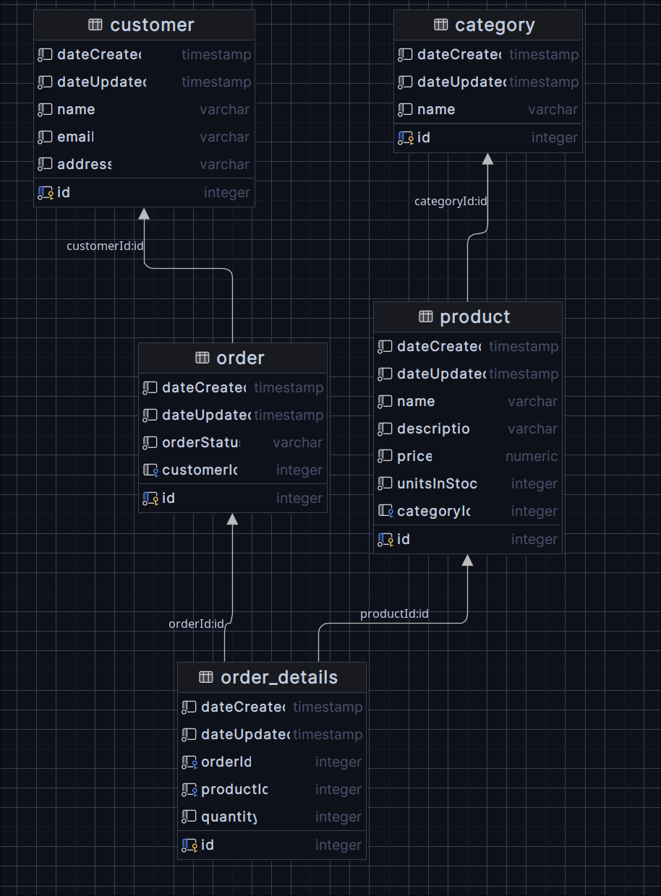

# Projekt Aplikacja Bazodanowa

|                |                                              |
| -------------- | -------------------------------------------- |
| Skład grupy    | Mateusz Ścianek (scianek@student.agh.edu.pl) |
| Temat projektu | Aplikacja e-commerce                         |
| Baza danych    | PostgreSQL                                   |
| Backend        | Node.js (TypeScript)                         |

## Uruchomienie aplikacji
### Docker
Najprostszym sposobem na uruchomienie aplkiacji jest skorzystanie z programu `docker`:
```bash
docker compose up
```
Uruchomiony kontener odsłania port `3000`, na którym działa REST API aplikacji.
Odsłonięty jest również port `5432`, na którym działa baza danych co pozwala podejrzeć jej stan przy pomocy zewnętrznych narzędzi.

### Bez Dockera
W celu uruchomienia aplikacji bez korzystania z Dockera konieczne jest uruchomienie bazy `PostgreSQL` we własnym zakresie. Wszystkie informacje niezbędne aplikacji do ustanowienia połączenia z bazą danych powinny być dostarczone przy pomocy następujących zmiennych środowiskowych (można je umieścić w pliku `.env` w głównym katalogu projektu):
- `DB_HOST`
- `DB_PORT`
- `DB_USER`
- `DB_PASS`
- `DB_NAME`

## Seedowanie bazy danych
Aplikacja posiada moduł odpowiedzialny za wypełnienie bazy danych przykładowymi danymi. **Aby z niego skorzystać należy w pliku `.env` umieścić odpowiednie informacje w zmiennych środowiskowych opisanych powyżej** (w przypadku korzystania z dockera wartości tych zmiennych należy przekopiować z pliku `docker-compose.yml`). Następnie należy uruchomić:
```
npm run seed
```

## Model aplikacji

Aplikacja jest realizacją prostego systemu type e-commerce. Głównym celem aplikacji jest demonstracja różnych operacji bazodanowych przez co wiele elementów często spotykanych w aplikacjach webowych, takich jak na przykład autentykacja/autoryzacja, zostało pominięte. Domena systemu składa się z następujących obiektów:
- `Product` - przechowuje nazwę, opis, kategorię, cenę oraz dostępną liczbę produktów
```ts
@Entity()
export class Product extends CoreEntity {
    @Column()
    @IsString()
    name: string;

    @Column()
    @IsString()
    description: string;

    @Column("decimal")
    @IsNumber()
    price: number;

    @Column()
    @IsInt()
    unitsInStock: number;

    @OneToMany(() => OrderDetails, orderDetail => orderDetail.product)
    orderDetails: OrderDetails[];

    @ManyToOne(() => Category, category => category.products, { eager: true })
    @JoinColumn({ name: "categoryId" })
    category: Category;
}
```
- `Category` - przechowuje nazwę kategorii, która może być przypisana produktom
```ts
@Entity()
export class Category extends CoreEntity {
    @Column()
    @IsString()
    name: string;

    @OneToMany(() => Product, product => product.category)
    products: Product[];
}
```
- `Customer` - przechowuje nazwę, email oraz adres klienta
```ts
@Entity()
export class Customer extends CoreEntity {
    @Column()
    @IsString()
    name: string;

    @Column()
    @IsString()
    email: string;

    @Column()
    @IsString()
    address: string;

    @OneToMany(() => Order, order => order.customer)
    orders: Order[];
}
```
- `Order` - przechowuje id klienta, który złożył zamówienie oraz szczegóły zawartości zamówienia
```ts
export const OrderStatus = {
    PROCESSING: "Processing",
    DELIVERED: "Delivered",
    CANCELLED: "Cancelled",
} as const;

export type OrderStatus = (typeof OrderStatus)[keyof typeof OrderStatus];

@Entity()
export class Order extends CoreEntity {
    @ManyToOne(() => Customer, customer => customer.orders, { eager: true })
    @JoinColumn({ name: "customerId" })
    customer: Customer;

    @OneToMany(() => OrderDetails, orderDetail => orderDetail.order, {
        eager: true,
        cascade: true,
        onDelete: "CASCADE",
    })
    orderDetails: OrderDetails[];

    @Column()
    orderStatus: OrderStatus;
}
```
- `OrderDetails` - przechowuje id produktu i liczbę jego sztuk oraz id zamówienia (join table relacji many-to-many między Product i Order)
```ts
@Entity()
export class OrderDetails extends CoreEntity {
    @Column()
    orderId: number;

    @Column()
    productId: number;

    @Column()
    quantity: number;

    @ManyToOne(() => Order, order => order.orderDetails, {
        onDelete: "CASCADE",
    })
    @JoinColumn({ name: "orderId" })
    order: Order;

    @ManyToOne(() => Product, product => product.orderDetails, { eager: true })
    @JoinColumn({ name: "productId" })
    product: Product;
}
```

## Operacje CRUD
Aplikacja odsłania endpointy postaci `/<entity>` dla operacji `GET` i `POST` oraz endpointy postaci `/<entity/:id` dla operacji `GET`, `PATCH` i `DELETE`, gdzie `<entity>` to `products`, `categories`, `customers` albo `orders`, a `:id` to id konkretnego obiektu. W ciele zapytań `POST` i `PATCH` powinny znajdować się dane niezbędne do stworzenia/aktualizacji obiektu.

W każdym module znajduje się kontroler, którego zadaniem jest przetwarzanie zapytań http oraz serwis, który przy użyciu repozytorium z ORMa wykonuje operacje na bazie danych.
Przykład z modułu `Products`:
```ts
@Controller("products")
export class ProductsController {
    constructor(private readonly productsService: ProductsService) {}

    @Get()
    getAllProducts() {
        return this.productsService.getProducts();
    }

    @Get(":id")
    getProductById(@Param("id") id: number) {
        return this.productsService.getProductById(id);
    }

    @Post()
    createProduct(@Body() createProductDto: CreateProductDto) {
        return this.productsService.createProduct(createProductDto);
    }

    @Patch(":id")
    updateProduct(
        @Param("id") id: number,
        @Body() updateProductDto: UpdateProductDto,
    ) {
        return this.productsService.updateProduct(id, updateProductDto);
    }

    @Delete(":id")
    deleteProduct(@Param("id") id: number) {
        return this.productsService.deleteProduct(id);
    }
}
```
```ts
@Injectable()
export class ProductsService {
    constructor(
        @InjectRepository(Product)
        private readonly products: Repository<Product>,
        private readonly categoriesService: CategoriesService,
    ) {}

    getProducts() {
        return this.products.find();
    }

    async getProductById(id: number) {
        const product = await this.products.findOne({ where: { id } });
        if (!product) {
            throw new NotFoundException(`Product with id ${id} not found`);
        }
        return product;
    }

    async createProduct(dto: CreateProductDto) {
        const category = await this.categoriesService.getCategoryById(
            dto.categoryId,
        );
        return this.products.save(this.products.create({ ...dto, category }));
    }

    async updateProduct(
        id: number,
        { categoryId, ...productProps }: UpdateProductDto,
    ) {
        await this.getProductById(id);
        if (categoryId) {
            const category =
                await this.categoriesService.getCategoryById(categoryId);
            return this.products.update({ id }, { ...productProps, category });
        }
        return this.products.update({ id }, productProps);
    }

    async deleteProduct(id: number) {
        await this.getProductById(id);
        return this.products.delete({ id });
    }
}
```

### Przykładowe operacje
Stworzenie klienta:
```js
// POST /customers
{
    name: "John Doe",
    email: "john@doe.com",
    address: "11 Example St."
}
```

Stworzenie kategorii:
```js
// POST /categories
{
    name: "Category 1"
}
```

Stworzenie produktu:

```js
// POST /products
{
    name: "Product 1",
    description: "Just a test product"
    price: 29.99,
    unitsInStock: 100
}
```

Stworzenie zamówienia:
```js
// POST /orders
{
    customerId: 1,
    orderDetails: [
        {
            productId: 1,
            quantity: 10
        }
    ]
}
```

Zmiana liczby sztuk zamawianego produktu w zamówieniu o id 1:
```js
// PATCH /orders/1
{
    orderDetails: [
        {
            productId: 1,
            quantity: 20
        }
    ]
}
```

Usunięcie zamówienia o id 1:
```
DELETE /orders/1
```

## Użycie transakcji
Aplikacja wykorzystuje transakcje w celu zapewnienia integralności danych między liczbą dostępnych produktów (`unitsInStock` w `Product`), a tworzonymi i aktualizowanymi zamówieniami. Przetwarzając szczegóły nowonadesłanego zamówienia może dojść do sytuacji, w której jeden z obiektów `OrderDetails` będzie wskazywał na niestniejący produkt lub będzie próbował umieścić w zamówieniu więcej sztuk produktu niż jest w danym momencie dostępne. Wówczas aplikacja informuje klienta o zaistniałym problemie, a dzięki wykorzystaniu transakcji stan bazy danych pozostaje niezmienny (zmiany wprowadzne przy przetwarzaniu poprzednich obiektów nie zostają utrwalone).

```js
// POST /orders
{
    customerId: 1,
    orderDetails: [
        {
            productId: 1,
            quantity: 30
        },
        {
            productId: 2,
            quantity: 50 // the unitsInStock for this product is actually 40
        }
    ]
}

// returns status code 422 Unprocessable Entity
// database state is unchanged
// no new order is created
// products' unitsInStock values are the same as before
```

W `SharedService` znajduje się metoda pozwalająca na wykonanie operacji na bazie danych w ramach transkacji. Przyjmuje ona callback, który w dowolnym momencie wykonania może rzucić wyjątek, po którym cała transakcja zostanie anulowana, a wyjątek zostanie rozpropagowany do reszty aplikacji.
```ts
async makeTransaction(
    callback: (queryRunner: QueryRunner) => Promise<any>,
) {
    const queryRunner = this.dataSource.createQueryRunner();
    await queryRunner.connect();
    await queryRunner.startTransaction();
    try {
        const result = await callback(queryRunner);
        await queryRunner.commitTransaction();
        return result;
    } catch (err) {
        await queryRunner.rollbackTransaction();
        throw err;
    } finally {
        await queryRunner.release();
    }
}
```

Przykładowe użycie powyższej metody w metodzie `createOrder`.
```ts
async createOrder({ customerId, orderDetails }: CreateOrderDto) {
    return this.sharedService.makeTransaction(async ({ manager }) => {
        const orders = manager.getRepository(Order);
        const order = await orders.save(
            orders.create({
                customer:
                    await this.customersService.getCustomerById(customerId),
                orderDetails: [],
                orderStatus: OrderStatus.PROCESSING,
            }),
        );
        await this.updateOrderDetails(order.id, orderDetails, manager);
        return order;
    });
}

private async updateOrderDetails(
    orderId: number,
    orderDetails: OrderDetailsDto[],
    manager: EntityManager,
) {
    const productsRepository = manager.getRepository(Product);
    const orderDetailsRepository = manager.getRepository(OrderDetails);
    for (const orderDetail of orderDetails) {
        const existingOrderDetail = await orderDetailsRepository.findOne({
            where: { orderId, productId: orderDetail.productId },
        });
        const product = await this.productsService.getProductById(
            orderDetail.productId,
        );

        if (existingOrderDetail) {
            const increase =
                orderDetail.quantity - existingOrderDetail.quantity;
            if (product.unitsInStock < increase) {
                throw new UnprocessableEntityException(
                    `Not enough units in stock for product ${product.name}, requested an increase by ${increase}, available: ${product.unitsInStock}`,
                );
            }
            product.unitsInStock -= increase;
            existingOrderDetail.quantity = orderDetail.quantity;
            await orderDetailsRepository.save(existingOrderDetail);
        } else {
            if (product.unitsInStock < orderDetail.quantity) {
                throw new UnprocessableEntityException(
                    `Not enough units in stock for product ${product.name}, requested: ${orderDetail.quantity}, available: ${product.unitsInStock}`,
                );
            }
            product.unitsInStock -= orderDetail.quantity;
            const newOrderDetail = orderDetailsRepository.create({
                orderId,
                productId: orderDetail.productId,
                quantity: orderDetail.quantity,
            });
            await orderDetailsRepository.save(newOrderDetail);
        }
        await productsRepository.save(product);
    }
}
```
W tej metodzie dochodzi do wywołania prywatnej pomocniczej metody `updateOrderDetails`, który spróbuje dodać do bazy danych informacje o nowotworzonym zamówieniu, a w momencie napotkania sytuacji nie pozwalającej na finalizację tej procedury (np. niedostatecznej liczby dostępnych sztuk produktu) rzuca wyjątek, który przerywa transakcję.

## Operacje raportujące
Aplikacja pozwala również na wykonanie kilku operacji o charakterze raportującym.

### `GET /reporting/sales-by-product`

```ts
async getSalesByProduct(): Promise<SalesByProductDto> {
    const orders = await this.orderService.getOrders();
    const sales = {};
    for (const order of orders) {
        for (const orderDetail of order.orderDetails) {
            if (sales[orderDetail.product.name]) {
                sales[orderDetail.product.name].unitsSold +=
                    orderDetail.quantity;
                sales[orderDetail.product.name].totalRevenue +=
                    orderDetail.quantity * orderDetail.product.price;
            } else {
                sales[orderDetail.product.name] = {
                    productName: orderDetail.product.name,
                    unitsSold: orderDetail.quantity,
                    totalRevenue:
                        orderDetail.quantity * orderDetail.product.price,
                };
            }
        }
    }
    return { sales: Object.values(sales) };
}
```

Dla każdego produktu zwraca liczbę sprzedanych sztuk oraz przychód uzyskany z jego sprzedaży.
Przykładowa odpowiedź aplikacji:
```json
{
    "sales": [
        {
            "productName": "Sleek Bronze Chicken",
            "unitsSold": 92,
            "totalRevenue": 4692
        },
        {
            "productName": "Awesome Granite Gloves",
            "unitsSold": 125,
            "totalRevenue": 6750
        },
        {
            "productName": "Generic Granite Bacon",
            "unitsSold": 154,
            "totalRevenue": 2618
        },
    ]
}
```

### `GET /reporting/sales-by-customer`
```ts
async getSalesByCustomer(): Promise<SalesByCustomerDto> {
    const orders = await this.orderService.getOrders();
    const sales = {} as Record<string, any>;
    for (const order of orders) {
        if (sales[order.customer.name]) {
            for (const orderDetail of order.orderDetails) {
                if (
                    sales[order.customer.name].productSales[
                        orderDetail.product.name
                    ]
                ) {
                    sales[order.customer.name].productSales[
                        orderDetail.product.name
                    ].unitsSold += orderDetail.quantity;
                    sales[order.customer.name].productSales[
                        orderDetail.product.name
                    ].totalRevenue +=
                        orderDetail.quantity * orderDetail.product.price;
                } else {
                    sales[order.customer.name].productSales[
                        orderDetail.product.name
                    ] = {
                        productName: orderDetail.product.name,
                        unitsSold: orderDetail.quantity,
                        totalRevenue:
                            orderDetail.quantity *
                            orderDetail.product.price,
                    };
                }
            }
        } else {
            sales[order.customer.name] = {
                customerName: order.customer.name,
                productSales: {},
            };
            for (const orderDetail of order.orderDetails) {
                sales[order.customer.name].productSales[
                    orderDetail.product.name
                ] = {
                    productName: orderDetail.product.name,
                    unitsSold: orderDetail.quantity,
                    totalRevenue:
                        orderDetail.quantity * orderDetail.product.price,
                };
            }
        }
    }
    return {
        sales: Object.values(sales).map(s => ({
            ...s,
            productSales: Object.values(s.productSales) as any,
        })),
    };
}
```

Dla każdego klienta zwraca listę produktów, które kupił, liczbę sztuk i przychód.
Przykładowa odpowiedź aplikacji:
```json
{
    "sales": [
        {
            "customerName": "Enrique Labadie",
            "productSales": [
                {
                    "productName": "Sleek Bronze Chicken",
                    "unitsSold": 11,
                    "totalRevenue": 561
                },
                {
                    "productName": "Awesome Granite Gloves",
                    "unitsSold": 20,
                    "totalRevenue": 1080
                },
            ]
        },
        {
            "customerName": "Joann Ortiz",
            "productSales": [
                {
                    "productName": "Elegant Steel Mouse",
                    "unitsSold": 8,
                    "totalRevenue": 184
                },
                {
                    "productName": "Luxurious Metal Ball",
                    "unitsSold": 12,
                    "totalRevenue": 540
                },
            ]
        }
    ]
}
```

### `GET /reporting/sales-by-category`
```ts
async getSalesByCategory(): Promise<SalesByCategoryDto> {
    const orders = await this.orderService.getOrders();
    const sales = {} as Record<string, any>;
    for (const order of orders) {
        for (const orderDetail of order.orderDetails) {
            if (sales[orderDetail.product.category.name]) {
                sales[orderDetail.product.category.name].unitsSold +=
                    orderDetail.quantity;
                sales[orderDetail.product.category.name].totalRevenue +=
                    orderDetail.quantity * orderDetail.product.price;
            } else {
                sales[orderDetail.product.category.name] = {
                    categoryName: orderDetail.product.category.name,
                    unitsSold: orderDetail.quantity,
                    totalRevenue:
                        orderDetail.quantity * orderDetail.product.price,
                };
            }
        }
    }
    return { sales: Object.values(sales) };
}
```
Dla każdej kategori zwraca liczbę sprzedanych sztuk produktów należących do tej kategorii oraz przychód uzyskany z tej sprzedaży.
Przykładowa odpowiedź aplikacji:
```json
{
    "sales": [
        {
            "categoryName": "Electronics",
            "unitsSold": 581,
            "totalRevenue": 34881
        },
        {
            "categoryName": "Games",
            "unitsSold": 957,
            "totalRevenue": 50178
        },
        {
            "categoryName": "Toys",
            "unitsSold": 689,
            "totalRevenue": 18754
        },
        {
            "categoryName": "Beauty",
            "unitsSold": 354,
            "totalRevenue": 27490
        },
        {
            "categoryName": "Shoes",
            "unitsSold": 385,
            "totalRevenue": 22451
        }
    ]
}
```

### `GET /reporting/low-stock-products?threshold=<n>`
```ts
async getLowStockProducts(threshold: number): Promise<LowStockProductsDto> {
    const products = await this.productService.getProducts();
    return {
        lowStockProducts: products
            .filter(p => p.unitsInStock < threshold)
            .map(
                ({ name, unitsInStock }) => ({ name, unitsInStock }) as any,
            ),
    };
}
```

Zwraca produkty, których liczba dostępnych sztuk jest mniejsza od podanego progu.
Przykładowa odpowiedź aplikacji:
```json
{
    "lowStockProducts": [
        {
            "name": "Generic Granite Bacon",
            "unitsInStock": 9
        },
        {
            "name": "Rustic Granite Pizza",
            "unitsInStock": 1
        }
    ]
}
```

### `GET /reporting/order-status-summary`
```ts
async getOrderStatusSummary(): Promise<OrderStatusSummaryDto> {
    const orders = await this.orderService.getOrders();
    const statuses = {} as Record<string, number>;
    for (const order of orders) {
        if (statuses[order.orderStatus]) {
            statuses[order.orderStatus] += 1;
        } else {
            statuses[order.orderStatus] = 1;
        }
    }
    return { statuses };
}
```
Zwraca ile jest zamówień w każdym z możliwych stanów (dostarczone, anulowane, realizowane itd.).
Przykładowa odpowiedź aplikacji:
```json
{
    "statuses": {
        "Processing": 17,
        "Cancelled": 12,
        "Delivered": 11
    }
}
```
